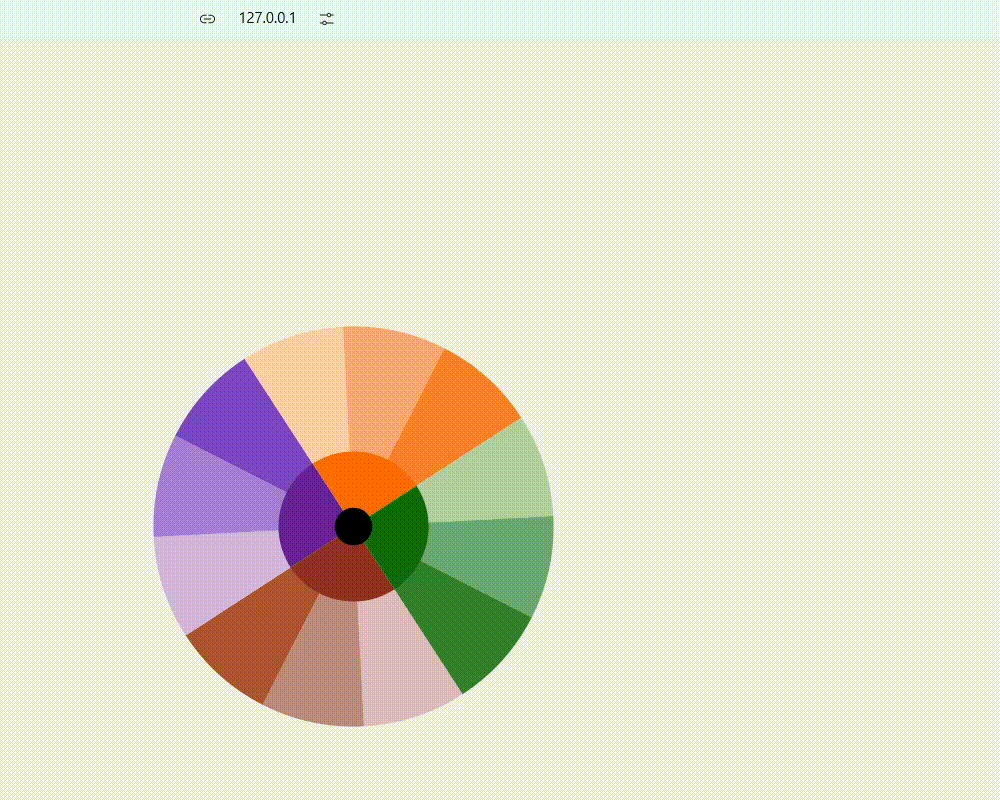

# SVG demo
Interactive spinning SVG color wheel.

## Showcase


## How it useful
Click on SVG wheel's part - get info about that.

## How to add to your project
You have to add this code to your html:
```html
<div id="color-wheel"></div>
<script type="module">
  import { ColorWheel } from "./script.js";

  document.addEventListener
  (
    'DOMContentLoaded',
    () =>
    {
      const colorWheel = new ColorWheel(); // default: id - "color-wheel", speedRot - 0.5
      // or
      // const colorWheel = new ColorWheel( 'your-div-id', speedRotation ); 
    }
  );
</script>
```
